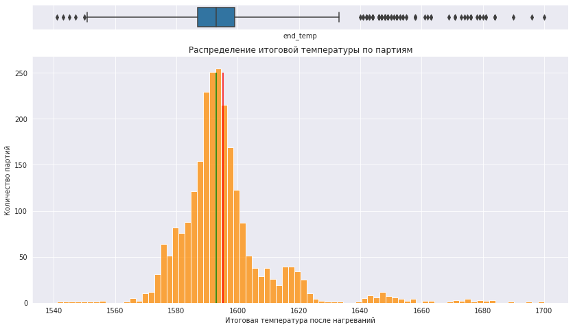
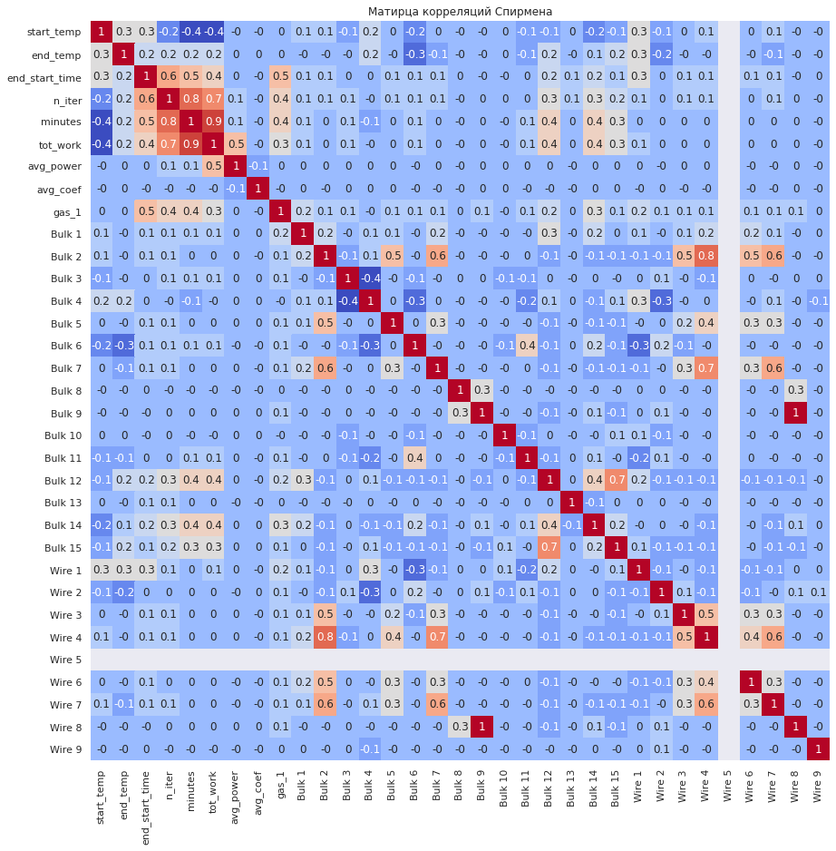
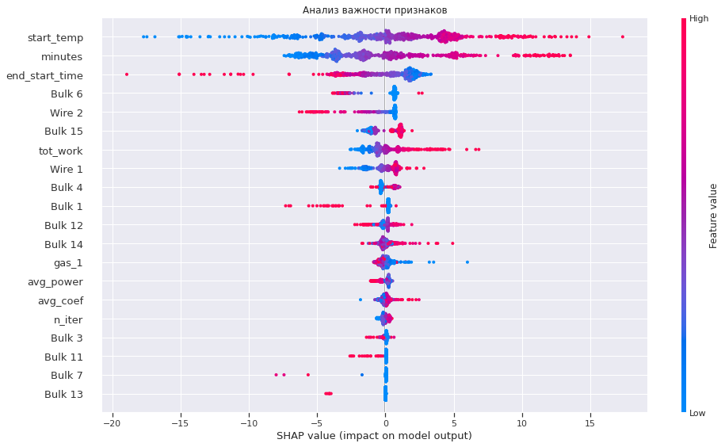

# Прогнозирование температуры стального сплава

Модель машинного обучения для контроля итоговой температуры сплава и поддержки решений по снижению энергопотребления металлургического производства.

## Executive summary

На данных о 3 241 партии стали исследованы нагрев электродами, продолжительность технологического цикла, подача газа и объёмы сыпучих и проволочных добавок. После объединения источников, обработки пропусков и аномалий для моделирования осталось 2 473 партии. Лучшая модель — `CatBoostRegressor` — достигла **MAE = 5,98 °C** на тестовой выборке при требовании заказчика не выше 6,8 °C.

Модель показывает, что итоговую температуру сильнее всего определяют начальная температура, чистое время нагрева и общая продолжительность обработки. Результат можно использовать как основу для раннего выявления риска перегрева и неэффективных плавок.

## Основные выводы

1. `CatBoostRegressor` показал лучший результат: **MAE = 5,98 °C** на тестовой выборке.
2. Наиболее важные признаки по SHAP — начальная температура, время нагрева и длительность процесса от первого до последнего нагрева.
3. На прогноз также влияют отдельные добавки, в частности `Bulk 6`, `Bulk 15` и `Wire 2`.
4. Суммарная работа электродов оказалась менее значимым фактором, чем температурные и временные характеристики.
5. В нескольких источниках отсутствуют данные за 14–17 июля; партии с отсутствующей целевой температурой исключены из моделирования.

## Стратегические рекомендации

- Встроить прогноз в диспетчерскую систему и показывать бригаде ожидаемую итоговую температуру, риск перегрева и текущую эффективность нагрева.
- Отдельно выявлять партии с долгим нагревом, большим числом итераций или избыточным энергопотреблением.
- Разработать дополнительную модель расхода энергии и использовать её для раннего определения «дорогих» плавок.
- Для повышения качества добавить массу стали, химический состав, температуру окружающей среды и степень износа ковша.

## Ограничения исследования

- Источники содержат разное количество партий и неполные временные интервалы.
- Единицы измерения мощности в описании данных не указаны.
- Пропуски в целевой температуре невозможно восстановить без внесения неподтверждённых значений.
- В модели нет данных о массе стали, химическом составе, состоянии оборудования и внешней температуре.

## Факты и гипотезы

**Подтверждено данными:** качество CatBoost на тесте; состав наиболее важных признаков; наличие пропусков за один и тот же июльский период; влияние начальной температуры и времени нагрева.

**Гипотезы для дальнейшей проверки:** июльский пропуск мог быть связан со сбоем производства, оборудования или системы сбора данных; необычно долгие циклы могут соответствовать сложным плавкам либо техническим проблемам.

## Ключевые графики

### Распределение итоговой температуры

### Корреляции признаков

### Важность признаков по SHAP

## Методология

1. Проверка и очистка семи источников технологических данных.
2. Агрегация операций до уровня партии и создание физических и временных признаков.
3. Объединение таблиц, обработка пропусков и удаление нереалистичных наблюдений.
4. Корреляционный анализ и исключение полностью коллинеарных признаков.
5. Сравнение `Ridge`, `RandomForestRegressor` и `CatBoostRegressor` с подбором гиперпараметров и кросс-валидацией.
6. Тестирование лучшей модели и интерпретация результата с помощью SHAP.

## Файлы

- [`steel-temperature-prediction.ipynb`](steel-temperature-prediction.ipynb) — полный анализ, обучение и интерпретация модели.

## Технологии

`Python` · `pandas` · `NumPy` · `scikit-learn` · `CatBoost` · `Optuna` · `SHAP` · `Matplotlib` · `Seaborn`
